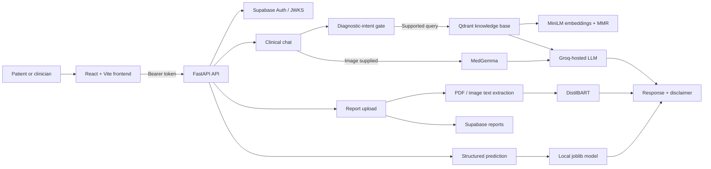
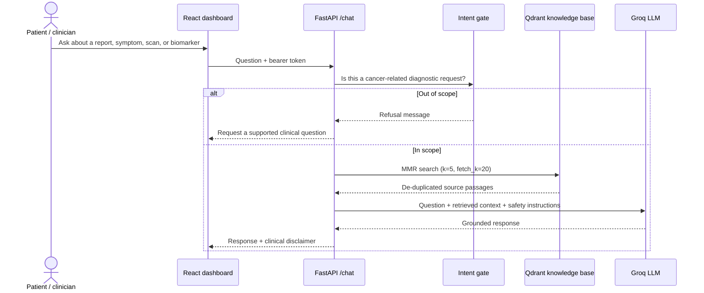
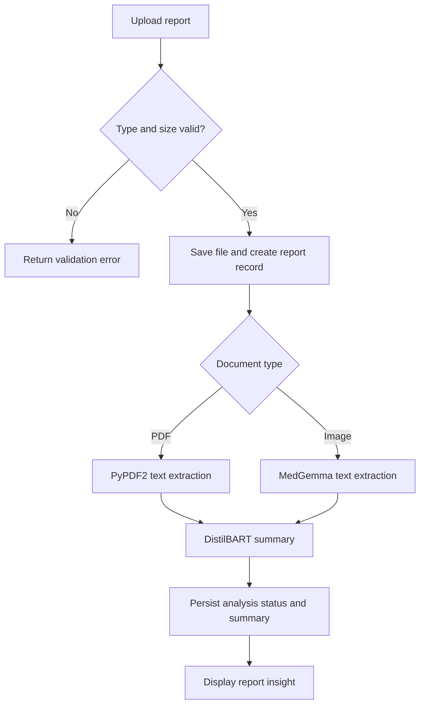

# ONCO DETECT AI

> **Evidence-grounded, AI-assisted cancer-risk insights — designed to inform, not diagnose.**


ONCO DETECT AI is a full-stack healthcare decision-support prototype that brings together patient reports, structured clinical indicators, medical-image understanding, and retrieval-augmented clinical chat. It gives patients and clinicians one workspace to explore cancer-related information while deliberately keeping a clinician in the decision loop.


> ONCO DETECT AI is a hackathon/research prototype, **not** a medical device. It does not diagnose cancer, replace a qualified clinician, or establish treatment. Model output must be reviewed by a suitably qualified healthcare professional.

## What the project does

| Capability | What ONCO DETECT AI provides |
| --- | --- |
| Guided clinical chat | Answers cancer-related diagnostic questions only when supporting information can be retrieved from the project’s medical knowledge base. |
| Report intake | Accepts PDF, JPEG, and PNG reports; extracts text and produces an AI-generated summary. |
| Image-aware assistance | Uses MedGemma for image/text interpretation when an image is provided, then pairs it with retrieved clinical context. |
| Structured risk signal | Produces a model prediction and confidence from age, mutation count, sample count, TMB, and sex. |
| Patient and doctor views | React dashboards support role-oriented journeys, report handling, risk overviews, symptom logging, medicines, and clinician discovery. |
| Secure application layer | Uses Supabase sign-in and bearer-token validation for protected chat and upload requests. |

## System at a glance



## How information moves through ONCO DETECT AI

### 1. Sign in and establish user context

The frontend sends credentials to `POST /login`. Supabase supplies an access token, which the frontend attaches as `Authorization: Bearer <token>` on protected calls. The API verifies the token using Supabase JWKS keys and uses the user identity and role for reports and chat history.

### 2. Ask a clinical question

`POST /chat` accepts a question, optional image URL, and optional vision score.



The retrieval flow uses `sentence-transformers/all-MiniLM-L6-v2` embeddings and Qdrant maximal-marginal-relevance search. ONCO DETECT AI refuses generic or unrelated requests. If retrieval fails or returns no context, it reports that limitation instead of improvising an answer.

### 3. Add visual context when available

When a chat request includes an image, the backend runs `google/medgemma-4b-it` through a Transformers image-to-text pipeline. Its observations are returned alongside—not instead of—the RAG clinical context. If MedGemma is unavailable, the API falls back cleanly to the grounded RAG response.

### 4. Upload and summarize a report

`POST /upload` accepts PDF, JPEG, and PNG files up to 10 MB. The server stores a safely named copy in `uploads/`, creates a report record, and processes analysis in a FastAPI background task.



### 5. Generate a structured prediction

`POST /predict` transforms age, mutation count, number of samples, non-synonymous TMB, and sex into the feature order expected by the bundled joblib model. It returns the predicted class and maximum model probability as a confidence percentage. This is a risk signal for discussion, not a clinical verdict.

## What is novel here

ONCO DETECT AI’s differentiator is the **guardrailed combination of modalities and evidence**:

1. **Grounding before generation.** Chat is constrained to retrieved Qdrant context, the LLM is told not to fill knowledge gaps, and source filenames are requested in answers.
2. **Multimodal context with fallback.** MedGemma image observations are coupled with clinical retrieval; if vision loading fails, grounded text support remains available.
3. **Three complementary pathways.** Users can ask evidence-backed questions, upload reports for readable summaries, or provide structured indicators for a model-based risk signal—without conflating any with a diagnosis.
4. **Fail-closed clinical behavior.** Unsupported questions are declined, and unavailable retrieval yields an explicit limitation rather than a plausible-sounding response.
5. **Workflow-aware design.** Role-oriented dashboards, background report processing, and persisted chat/report records support continuity beyond a one-off prompt.

## Technology

| Layer | Stack |
| --- | --- |
| Frontend | React 18, TypeScript, Vite, Material UI, Tailwind utilities |
| API | Python, FastAPI, Uvicorn, Pydantic |
| Authentication and data | Supabase Auth, JWT/JWKS validation, Supabase tables |
| Retrieval | LangChain, Hugging Face embeddings, Qdrant |
| Generative AI | Groq API (`openai/gpt-oss-120b`), Transformers |
| Medical/image and summary models | MedGemma 4B IT, DistilBART CNN 12-6 |
| Prediction | NumPy, scikit-learn-compatible joblib artifacts |

## Repository map

```text
.
├── src/                    # React UI, routes, dashboards, API client
├── main.py                 # FastAPI app and core API routes
├── routes/uploads.py       # Authenticated report upload workflow
├── agents/                 # Prediction, MedGemma, summarization
├── rag/retrival.py         # Intent gate, Qdrant retrieval, LLM prompt
├── services/ai_analysis.py # Background report analysis
├── auth/auth.py            # Supabase JWT verification
├── utils/extractor.py      # PDF text extraction
├── images/                 # README and application assets
└── requirements.txt        # Python dependencies
```

## Run locally

### Prerequisites

- Node.js 18+
- Python 3.10+
- A Supabase project
- A Qdrant collection named `cancer_rag`
- Groq, Hugging Face, and Qdrant credentials

### 1. Configure the backend

```powershell
python -m venv .venv
.\.venv\Scripts\Activate.ps1
python -m pip install --upgrade pip
python -m pip install -r requirements.txt
```

Transformers requires PyTorch 2.6+ to load the DistilBART checkpoint securely. The current `requirements.txt` caps Torch below that version, so first change its Torch line to `torch>=2.6,<3.0`; then run:

```powershell
python -m pip install --upgrade "torch>=2.6"
```

Create `.env` beside `main.py`:

```env
SUPABASE_URL=https://your-project.supabase.co
SUPABASE_KEY=your-anon-key
SUPABASE_SERVICE_ROLE_KEY=your-service-role-key
GROQ_API_KEY=your-groq-api-key
QDRANT_URL=https://your-qdrant-instance
QDRANT_API_KEY_CLOUD=your-qdrant-api-key
HF_TOKEN=your-hugging-face-token
```

Start the API:

```powershell
uvicorn main:app --reload
```

The API is available at `http://127.0.0.1:8000`; OpenAPI docs are at `http://127.0.0.1:8000/docs`.

### 2. Start the frontend

Open a second terminal in the same directory:

```powershell
npm install
npm run dev
```

The frontend currently targets `http://localhost:8000` in `src/services/api.ts`.

### Demo credentials

For local UI testing, the frontend accepts `test@example.com` with password `123456789` and sends a mock token. This is only for local/demo use; remove it before production.

## API quick reference

| Method | Endpoint | Authentication | Purpose |
| --- | --- | --- | --- |
| `POST` | `/login` | No | Sign in through Supabase |
| `POST` | `/chat` | Yes | Grounded clinical Q&A; can include image URL/vision score |
| `POST` | `/upload` | Yes | Upload a PDF, JPEG, or PNG report |
| `POST` | `/predict` | No | Produce structured-model prediction and confidence |

Example prediction request:

```json
{
  "Diagnosis_Age": 52,
  "Mutation_Count": 14,
  "Number_of_Samples_Per_Patient": 2,
  "TMB_nonsynonymous": 8.4,
  "Sex": "Female"
}
```

## Deployment notes

The repository includes a `Dockerfile` and `Procfile`. Before deployment, configure explicit CORS origins, remove demo authentication, secure file storage, pin compatible Torch/Transformers versions, and review all applicable privacy, security, and clinical regulations. Never expose the Supabase service-role key to the browser.

## Team

Built as an ONCO DETECT AI hackathon project by **Hitesh** and **Anushka**.
